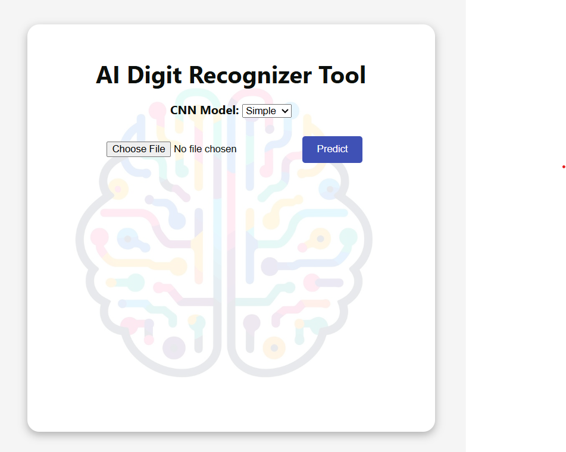
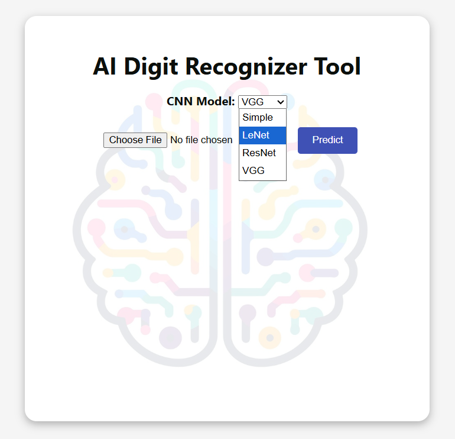
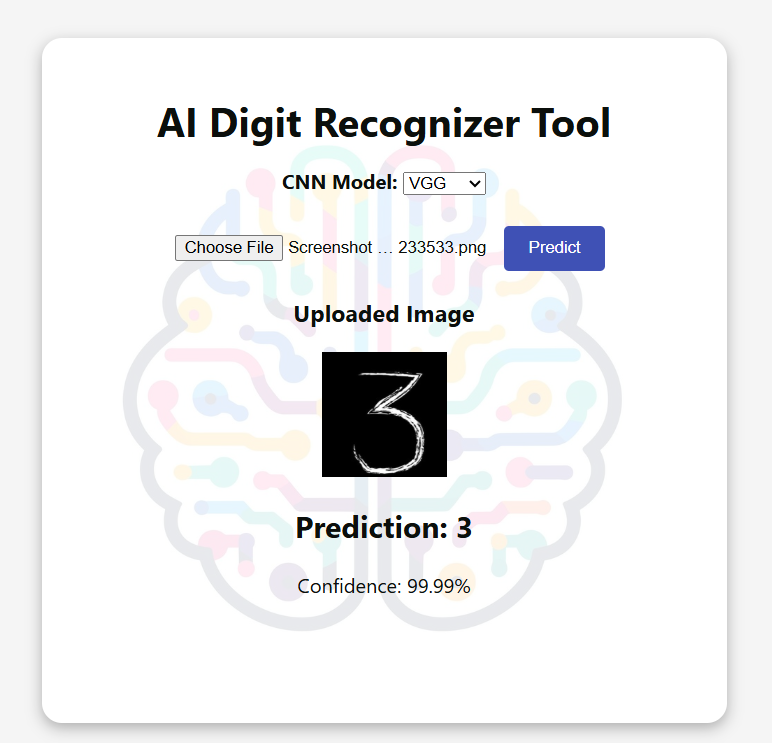

# 🧠 AI Digit Recognizer Tool

This project is a web-based AI-powered digit recognition app. Upload an image of a handwritten digit (0–9), choose a CNN model, and get the prediction!

---

## 🔍 Demo Screenshots





---

## 📦 Tech Stack

- **Frontend**: React.js
- **Backend**: Flask
- **Models**: Custom-trained CNNs (Simple, LeNet, ResNet, and VGG)
- **Dataset**: MNIST

---

## 🚀 How to Run Locally

```bash
cd api/
python app.py
